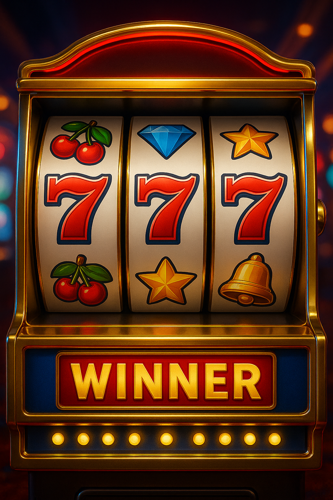

# 🎰 SpartakCasino

**Профессиональное казино для OpenComputers с графическим интерфейсом в стиле MineOS**

[](https://github.com/IgorTimofeev/MineOS)
[](https://github.com/MightyPirates/OpenComputers)
[](LICENSE)

## 📖 Описание

SpartakCasino - это полнофункциональное казино-приложение для OpenComputers, разработанное с использованием библиотек MineOS GUI. Приложение включает три классические азартные игры с красивым графическим интерфейсом, анимациями и системой баланса.


## ✨ Особенности

### 🎮 Три игры:

1. **🎰 Игровые автоматы (Слоты)**
   - Ставка: 100 кредитов
   - Джекпот: 1000 кредитов (x10)
   - 5 символов: 7️⃣ 💎 🍒 ⭐ 🔔
   - Плавная анимация вращения

2. **🎡 Рулетка**
   - Ставка: 200 кредитов
   - Красное/Чёрное: 400 кредитов (x2)
   - Зелёное: 2000 кредитов (x10)
   - Реалистичная анимация колеса

3. **🎲 Кости**
   - Ставка: 150 кредитов
   - Выигрыш: 300 кредитов (x2)
   - Условие: сумма > 7
   - Анимация броска

### 🎨 Дизайн:

- ✅ Профессиональный GUI на базе MineOS
- ✅ Роскошные изображения (логотип, слоты, рулетка, кости, фон)
- ✅ Цветовая схема: золото, красный, зелёный
- ✅ Плавные анимации
- ✅ Система баланса с отображением
- ✅ Интуитивный интерфейс

## 📦 Установка

### Требования:

- **OpenComputers** (Minecraft 1.7.10)
- **MineOS** установленная на компьютере
- **Tier 2+** компоненты (CPU, GPU, RAM, Screen)
- **Internet Card** (для установки через GitHub)

### Способ 1: Через MineOS App Market (рекомендуется)

1. Запустите MineOS
2. Откройте **App Market**
3. Найдите **SpartakCasino**
4. Нажмите **Install**

### Способ 2: Ручная установка

1. Скачайте репозиторий:
```lua
wget -f https://raw.githubusercontent.com/ВАШ_USERNAME/SpartakCasino/main/install.lua /tmp/install.lua && /tmp/install.lua
```

2. Или клонируйте репозиторий:
```bash
cd /MineOS/Applications/
git clone https://github.com/ВАШ_USERNAME/SpartakCasino.git
```

3. Перезапустите MineOS или обновите список приложений

## 🚀 Использование

1. Запустите MineOS
2. Найдите иконку **SpartakCasino** на рабочем столе
3. Кликните для запуска
4. Выберите игру из главного меню
5. Наслаждайтесь!

### Управление:

- **Левый клик мыши** - выбор кнопок
- **ESC** - закрыть окно игры
- Баланс отображается в верхней части экрана

## 🎯 Игровой процесс

### Стартовый баланс: 10,000 кредитов

**Стратегия:**
- Слоты: низкий риск, высокая награда (джекпот x10)
- Рулетка: средний риск, средняя награда (зелёное x10, красное/чёрное x2)
- Кости: низкий риск, стабильная награда (x2)

## 🖼️ Скриншоты

### Главное меню


### Игровые автоматы


### Рулетка


### Кости


## 🛠️ Разработка

### Структура проекта:

```
SpartakCasino/
├── Applications/
│   └── SpartakCasino.app/
│       ├── Main.lua          # Главный файл приложения
│       └── Icon.pic          # Иконка приложения
├── Images/                    # Изображения для интерфейса
│   ├── logo.png
│   ├── slot_machine.png
│   ├── roulette.png
│   ├── dice.png
│   └── background.png
├── Localizations/             # Локализации
│   ├── Russian.lang
│   └── English.lang
└── README.md
```

### Технологии:

- **Lua** - язык программирования
- **MineOS GUI** - библиотека интерфейса
- **OpenComputers** - мод для Minecraft

## 📝 Лицензия

MIT License - см. файл [LICENSE](LICENSE)

## 👨‍💻 Автор

**Manus AI**

- GitHub: [@ВАШ_USERNAME](https://github.com/ВАШ_USERNAME)

## 🙏 Благодарности

- [IgorTimofeev](https://github.com/IgorTimofeev) - за MineOS
- [MightyPirates](https://github.com/MightyPirates) - за OpenComputers
- Сообщество OpenComputers

## 📮 Поддержка

Если у вас возникли проблемы или есть предложения:

1. Откройте [Issue](https://github.com/ВАШ_USERNAME/SpartakCasino/issues)
2. Опишите проблему подробно
3. Приложите скриншоты (если возможно)

## 🔄 Обновления

### v1.0.0 (2025-10-25)
- ✅ Первый релиз
- ✅ Три игры: слоты, рулетка, кости
- ✅ Графический интерфейс MineOS
- ✅ Система баланса
- ✅ Анимации

---

**Удачи в игре! 🎰✨**

